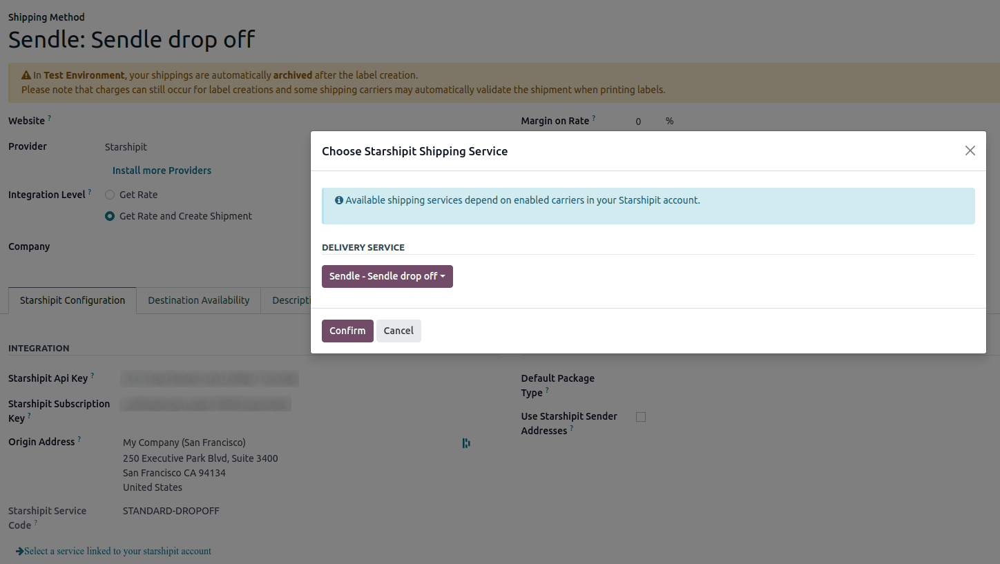

===========================================
Set up Starshipit shipping services in Odoo
===========================================

Starshipit is a shipping service operator that facilitates the integration of Australasian
shipping carriers with Odoo. Once integrated, users can create shipping methods that will
automatically get rates from specific couriers (such as Australia Post, NZ Post, DHL,...)
based on predefined conditions.

Setup in Starshipit
===================

Create an account and activate carriers
---------------------------------------

To get started, go to `Starshipit's platform <https://starshipit.com/>`_ to configure the account
and generate the connector credentials. Log in with the Sendcloud account, or create a new one if
needed.

Pickup address configuration
----------------------------

Once logged into the Starshipit account, navigate to :menuselection:`Settings --> Pickup address`,
and fill in the field for :guilabel:`Pickup address`. It should be the same address as the
warehouse your are shipping from.
This will be used if the :guilabel:`Use Starshipit Sender’s Address` is enabled on your shipping
carrier inside Odoo.

.. image:: starshipit_shipping/starshipit-settings-address.png
   :align: center
   :alt: Adding addresses in the Starshipit settings.

Couriers configuration
----------------------

Next, navigate to :menuselection:`Settings --> Couriers`,
and adding any :guilabel:`Couriers` you wish to integrate with.

.. image:: starshipit_shipping/starshipit-settings-couriers.png
   :align: center
   :alt: Adding addresses in the Starshipit settings.

.. tip::
   You can find details on how to integrate with the different couriers in
   `Starshipit's support center <https://support.starshipit.com/hc/en-us/>`_.

Couriers services configuration
-------------------------------

In the checkout rates settings, you will need to set which services provided by your couriers
you wish to see available when adding shipping in Odoo.

.. image:: starshipit_shipping/starshipit-checkout-rate.png
   :align: center
   :alt: Checkout rates in the Starshipit settings.

Shipping rules configuration
----------------------------

Finally, you will need to configure shipping rules in starshipit. These are used when placing
shipping order to set the correct courier on your order. There is multiple way of doing so, the
simplest being to add a rule that verify if the shipping method is a specific product code, and then
select the related courier.

.. image:: starshipit_shipping/starshipit-rules.png
   :align: center
   :alt: Shipping rules in the Starshipit settings.

Finding Starshipit API credentials
----------------------------------

In the Starshipit account, navigate to :menuselection:`Settings --> API` in the menu on the
left. There, you can find the API keys you will need in the next step.

.. image:: starshipit_shipping/starshipit-settings-api.png
   :align: center
   :alt: Finding the Starshipit API keys.

Setup in Odoo
=============

Install the Starshipit shipping module
--------------------------------------

After the Starshipit account is set up and configured, it's time to configure the Odoo database.
To get started, go to Odoo's :guilabel:`Apps` module,  search for the :guilabel:`Starshipit
Shipping` integration, and install it.

.. image:: starshipit_shipping/starshipit-app.png
   :align: center
   :alt: Starshipit Shipping module in the Odoo Apps module.

Starshipit shipping connector configuration
-------------------------------------------

Once installed, activate the :guilabel:`Starshipit Shipping` module in :menuselection:`Inventory -->
Configuration --> Settings`. The :guilabel:`Starshipit Connector` setting is found under the
:guilabel:`Shipping Connectors` section.

After activating the :guilabel:`Starshipit Connector`, click on the :guilabel:`Starshipit Shipping
Methods` link below the listed connector. Once on the :guilabel:`Shipping Methods` page, click
:guilabel:`Create`.

.. tip::
   :guilabel:`Shipping Methods` can also be accessed by going to :menuselection:`Inventory -->
   Configuration --> Delivery --> Shipping Methods`.

Fill out the following fields in the :guilabel:`New Shipping Method` form:

- :guilabel:`Shipping Method`: type `Starshipit`.
- :guilabel:`Provider`: select :guilabel:`Starshipit` from the drop-down menu.
- :guilabel:`Delivery Product`: set the product that was configured for this shipping method or
  create a new product.
- In the :guilabel:`Starshipit Configuration` tab, enter the :guilabel:`Default Package Type`
  if you are going to use packages during shipping in order to get more accurate rates.
  The packages system may be enabled in the Odoo settings.
- In the :guilabel:`Starshipit Configuration` tab, enter the :guilabel:`Use Starshipit Sender’s
  Address` if you wish to let starshipit set the sender address for you instead of Odoo.
- In the :guilabel:`Starshipit Configuration` tab, enter the :guilabel:`Origin Address`.
  It will be used as sending address when getting available services for your integration.
- In the :guilabel:`Starshipit Configuration` tab, enter the :guilabel:`Starshipit API Key`.
- In the :guilabel:`Starshipit Configuration` tab, enter the :guilabel:`Starshipit Subscription Key`
  .
- Manually :guilabel:`Save` the form by clicking the cloud icon next to the :guilabel:`Shipping
  Methods / New` breadcrumbs.

After configuring and saving the form, follow these steps to load the shipping products:

- In the :guilabel:`Starshipit Configuration` tab of the :guilabel:`New Shipping Method` form, click
  on the :guilabel:`Select a service linked to your starshipit account` link.
- Select the shipping service the company would like to use for deliveries and returns.
- Click :guilabel:`Confirm`.

.. example::
   Sample Starshipit shipping products configured in Odoo:

   | :guilabel:`Sendle: Sendle drop off`
   | :guilabel:`Shipping Product`: `Sendle Delivery`
   | :guilabel:`Starshipit Service Code`: `STANDARD-DROPOFF`

.. tip::
   Starshipit does not provide test keys when a company tests the sending of a package in Odoo. This
   means if a package is created, your account may be charged.

   Odoo has a built-in layer of protection against unwanted charges when using test environments.
   Within a test environment, if a shipping method is used to create labels, then those labels are
   immediately canceled after the creation — this occurs automatically. Please note that depending
   on the shipping provider being used, charges may still occur and you may need to cancel your
   orders on the provider platform. The test and production environment settings can be toggled back
   and forth from the :guilabel:`Smart Buttons`.

Generate a label with Starshipit
--------------------------------

When creating a quotation in Odoo, add shipping and a :guilabel:`Starshipit shipping method`.
You can get the shipping rate at this point by pressing :guilabel:`Get rate`.

Then, :guilabel:`Validate` the delivery. Shipping label documents are automatically generated in the
chatter, which include the following:

#. :guilabel:`Shipping label(s)` depending on the number of packages.
#. :guilabel:`Return label(s)` if the Starshipit connector is configured for returns.

Additionally, the tracking number is now available.

.. important::
   The packages weight is not automatically verified before sending them to the shipping provider.
   Please make sure that you select the correct shipping option for your package, otherwise you
   may end up with an error.
   Starshipit verifies the destination address during the order creation too, so make sure it is
   correct as well.
   Finally, some couriers may required other information, such as an email address or phone number.
   Please ensure that all necessary information are set upon sending a shipping order.

Returns
-------

Starshipit supports returns if you are using one of the following couriers:
 * Australia Post eParcel
 * TNT
 * Couriers Please
 * Aramex
 * StarTrack
 * DHL Express
 * NZ Post Domestic

This can be done by pressing the :guilabel:`Return` smart button on the concerned delivery order.
If the selected courier supports returns, you will see a :guilabel:`Print Return Label` option on
the return order.

Cancellations
-------------

If you happen to cancel a delivery order, it will be automatically archived in Starshipit.
However, the cancellation will not be sent to the courier itself, so you will need to connect
on the courier platform in order to handle the cancellation manually.
